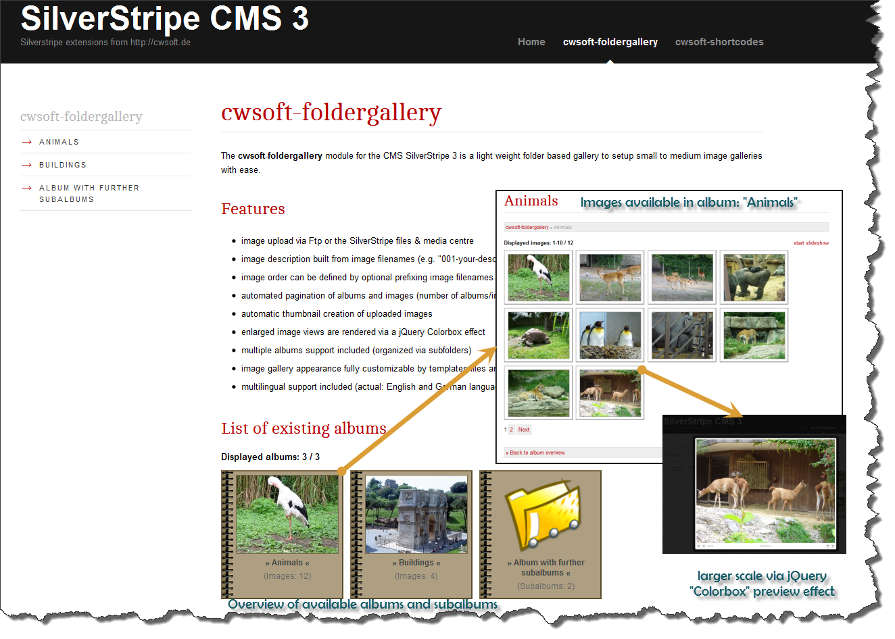

# Folder based image gallery for CMS SilverStripe 3.0.x
The `cwsoft-foldergallery` module is a light weight, simple to use folder based image gallery for the [CMS SilverStripe 3](http://silverstripe.org) which enables you to setup small to medium image galleries with ease.

## Features
- images displayed from SilverStripe assets folder (upload via Ftp or SilverStripe files & media section)
- automatic thumbnail creation of album cover images, album pictures and the [ColorBox](http://www.jacklmoore.com/colorbox) preview images
- automatic album and image pagination (number of albums/images per pages configurable via "_config/settings.yml")
- option to start slide show for displayed images by mouse click
- image description built from image filenames (e.g. "001-your-description.jpg" --> "Your description")
- image display order configurable via "_config/settings.yml" (sort by: Filename, Creation, LastEdited in ASC/DESC order)
- multiple albums support included (organized via subfolders)
- image gallery appearance customizable via template and CSS files
- multilingual support included (actual: English, Dutch, French and German)

## Download
You can download an archive of the cwsoft-foldergallery module for SilverStripe 3.0.x from the GitHub [3.0.x](https://github.com/cwsoft/silverstripe-cwsoft-foldergallery/archive/3.0.x.zip) branch. The archives of previous module releases can be found in GitHubs [Tags section](https://github.com/cwsoft/silverstripe-cwsoft-foldergallery/tags). The development history is tracked via GitHub.

Note: You can download the last stable version of the cwsoft-foldergallery module for SilverStripe [2.4.x](https://github.com/cwsoft/silverstripe-cwsoft-foldergallery/tree/2.4.x) and [3.1.x](https://github.com/cwsoft/silverstripe-cwsoft-foldergallery/) series from GitHub.

## License
The `cwsoft-foldergallery` module is licensed under the [GNU General Public License (GPL) v3.0](http://www.gnu.org/licenses/gpl-3.0.html).

## Requirements
The minimum requirements to get the cwsoft-foldergallery module running on your SilverStripe installation are as follows:

- SilverStripe ***3.0.x***
- PHP ***5.3*** or higher (recommended last stable PHP 5.4.x version)

## Installation
1. download latest [module archive](https://github.com/cwsoft/silverstripe-cwsoft-foldergallery/archive/3.0.x.zip) from GitHub
2. unpack the archive on your local computer
3. upload the entire `cwsoft-foldergallery` folder to your SilverStripe root folder using your preferred Ftp program
4. update your SilverStripe database via `http://yourdomain.com/dev/build?flush=all`

## Adapt foldergallery layout to match your theme layout
By default, the Foldergallery layout matches the SilverStripe 3.x standard `simple` theme layout. You can adapt the Foldergallery layout to match your theme by following the steps below.

1. copy `themes/your-theme/templates/Layout/Page.ss` to `cwsoft-foldergallery/templates/Layout/cwsFolderGalleryPage.ss`
2. add the code `<% include Foldergallery %>` after `$Content` (in file cwsFolderGalleryPage.ss)
3. flush the cache and visit the Foldergallery page in your frontend

## Usage
To setup a `cwsoft-foldergallery` page with two albums "Animals" and "Buildings", just follow the steps shown in the sketch below. The steps below assume you have already installed the module before.

 

1. Create a page of type `Foldergallery` (will serve as album overview) and save it (saving will create the folder 'assets/cwsoft-foldergallery for you)
2. Create album folders `animals` and `buildings` inside `assets/cwsoft-foldergallery` via SilverStripe Files section and upload images to it. Images named "001-this-will-be-the-first-image.jpg" get a description as follows: "This will be the first image". The first image in an album folder will be used as album cover image.
3. For the album overview page (container), we do not need to select an album image folder. This step is only required for the album children pages created in step 5
4. Provide a description for the album overview page or the album pages via the WYSIWYG editor and save the page if done
5. Now create child pages of type `Foldergallery` for the albums `Animals` and `Buildings`. Choose the album image folder from the dropdown box (3) and provide a album description via the WYSIWYG editor (4) and save the pages

Tip: If you do just want to show a single page with images on it, just follow steps 1 through 4, but choose an image folder in step 3. 

A collage of the frontend view for this set-up is shown below:

***Collage (album overview / album page / Colorbox effect):***
 

## Known Issues
Known issues can be tracked and reported via GitHubs [issue tracking service](https://github.com/cwsoft/silverstripe-cwsoft-foldergallery/issues). If you run into any issues with the cwsoft-foldergallery module, visit the issue tracker and check if a similar issue was already reported. If not, just add a new topic descriping your issue.

## Questions
If you have questions or issues with cwsoft-foldergallery, please visit the [SilverStripe](http://www.silverstripe.org/all-other-modules/show/20738) forum thread and ask for feedback.

***Always provide the following information with your support request:***

 - detailed error description (what happens, what have you already tried ...)
 - the cwsoft-foldergallery version used
 - your PHP and SilverStripe version used
 - information about your operating system (e.g. Windows, Mac, Linux) incl. version
 - information of your browser and browser version used

## Credits
Credits go to the following SilverStripe community members who helped in one way or another to continually improve the `cwsoft-foldergallery` module - thanks guys highly appreciated.

 - [Kereru](http://www.silverstripe.org/ForumMemberProfile/show/26608): Bug report on thumbnail creation
 - [haantje72](http://www.silverstripe.org/ForumMemberProfile/show/5933): Dutch translation, ideas and suggestions for further improvements
 - [Juanitou](http://www.silverstripe.org/ForumMemberProfile/show/3189): French translation, bugfixes, [i18n Javascript support](https://github.com/cwsoft/silverstripe-cwsoft-foldergallery/commit/9273343fa07eee5e3a5b2f05760237e397010193) 
